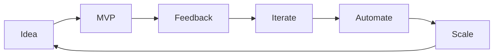

# 👋 Hi, I’m @tanahiro2010

> 学生エンジニア / Discord Bot 開発 / Web サービス構築 / YouTube クリエイター (登録者 ~200人)


[](https://github.com/tanahiro2010?tab=followers)
[](#) <!-- チャンネルID差し替え -->
[](https://x.com/tanahiro2010)

---

## 🧑‍💻 自己紹介

| 項目 | 内容 |
|------|------|
| 名前 | tanahiro2010 |
| 誕生日 | 2010-08-18 |
| 活動領域 | Discord Bot / Web Backend / API連携 / ツール作成 |
| 主言語 | Ruby / Python / Node.js (TypeScript) / C# |
| スタイル | 「まず動くもの」を最速で形に → 改善と自動化 |
| 現在 | 案件募集中（学生） |
| 連絡先 | herentongkegu087@gmail.com |
| モットー | Ship fast. Learn faster. |

---

## 🛠 Tech Stack

### Languages


### Frameworks / Libraries


### Databases / Infra


### Tools / Others


---

## 📊 GitHub Stats

<p align="left">
  
  
</p>

<p align="left">
  
</p>

---

## 🚀 注力していること

- Discord Bot の高度な機能（多言語対応、モデレーション、自動化）
- API連携 (YouTube / Discord / OpenAI など) を使ったサービス構築
- Webサービスの MVP 素早い実装 → 運用 → 改善
- パフォーマンスと再利用性を意識したモジュール設計
- 学習ログ・制作過程の可視化（YouTube / X）

---

## 🧪 最近のアイデア例 (プレースホルダ)

| 分類 | 例 |
|------|----|
| Discord | Slash Commands / 統計ダッシュボード / ミュージックプレイヤー |
| Web | APIラッパ / Bot 管理パネル / 学習支援ツール |
| DevOps | 自動デプロイスクリプト / CI テスト / 依存監視 |
| Data | ログ解析 / キャッシュ層最適化 / Webhook 分析 |

（実際の代表リポジトリリンクを後で追記）

---

## 🧷 ピン留め候補（編集して実リポジトリリンクに差し替え）

| プロジェクト | 説明 | 技術 |
|--------------|------|------|
| `discord-bot-xxx` | 高機能Discord Bot（モデレーション＋通知） | Node.js / TypeScript / Redis |
| `api-wrapper-xxx` | 外部API統合ラッパライブラリ | Python / FastAPI |
| `web-dashboard-xxx` | Bot 管理用ダッシュボード | Ruby on Rails / PostgreSQL |
| `automation-scripts` | 開発自動化スクリプト集 | Shell / GitHub Actions |

---

## 🔄 ワークフロー思想

1. アイデアを小さく分割し即 MVP
2. テレメトリ & ログ収集
3. ボトルネック特定 → 自動化
4. ドキュメント化 & 知識共有
5. 継続的改善 (Kaizen Loop)



---

## 🛎 コラボ・案件募集

- 学生ながら開発経験を積極的に拡張中
- 小規模～個人開発補助 / Bot 制作 / API連携歓迎
- 技術的チャレンジ・高速試作が得意

お気軽にメールへ: **herentongkegu087@gmail.com**

---

## 🎥 コンテンツ / 発信

| プラットフォーム | 備考 |
|------------------|------|
| YouTube | 登録者 ~200人（伸ばし中） |
| X(Twitter) | 日々の進捗 / Tips / 思考共有 |
| GitHub | 実験・公開コード / 継続的改善 |

---

## 💡 今後の目標

- OSS への継続的コントリビュート
- TypeScript + Rust（将来）での高速化領域探索
- 自作サービスのユーザ 1,000人到達
- 技術×教育系コンテンツ配信の体系化

---

## 🧰 開発スニペット（例）

```ruby
# Simple Rack-like endpoint idea (concept)
require 'json'
def handler(req)
  { status: 200, body: { ok: true, time: Time.now }.to_json }
end
```

```python
# FastAPI micro endpoint (concept)
from fastapi import FastAPI
app = FastAPI()

@app.get("/health")
def health():
    return {"status": "ok"}
```

---

## 📫 Contact & Links

- ✉️ Email: `herentongkegu087@gmail.com`
- 🐦 Twitter / X: [@tanahiro2010](https://x.com/tanahiro2010)
- 🧪 GitHub: [github.com/tanahiro2010](https://github.com/tanahiro2010)

---

## 📝 備考（編集ガイド）

- YouTube のバッジ: チャンネルIDに差し替えて有効化
- ピン留め: 実際の代表リポジトリ URL に差し替え
- Stats サービス（vercel系）は時間で停止する場合あり → ミラー検討
- Trophy/Stats が遅い場合はコメントアウト可能
- 必要なら英語版 README (README.en.md) を追加

---

最後まで読んでくれてありがとうございます。  
もしよければ ⭐️ Star やフォローで応援してください！

