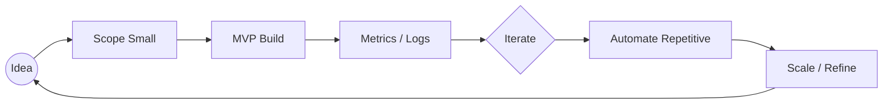

<!--
README Styling Guide:
- 余計な外部リクエストが多いと読み込みが重くなるので必要に応じてコメントアウトして調整してください。
- SVGバナーやアニメーションは自作して差し替え可能です。
-->

<p align="center">
  <!-- Hero Banner (差し替え推奨) -->
  
</p>

<p align="center">
  
</p>

<p align="center">
  <strong>学生エンジニア / Discord Bot / Web & API / Next.js / YouTube</strong><br/>
  <em>Ship fast. Learn faster.</em>
</p>

<p align="center">
  <a href="https://github.com/tanahiro2010">
    
  </a>
  <a href="https://github.com/tanahiro2010?tab=followers">
    
  </a>
  <!-- YouTube Channel ID に差し替え -->
  
  <a href="https://x.com/tanahiro2010">
    
  </a>
  
</p>

---

## 🪄 About

> 2010年8月18日生。サーバサイドからフロント、Bot、オートメーションまで“動く価値”を最速で届けるのが好き。現在案件募集中。

| Key | Value |
|-----|-------|
| 主軸 | Discord Bot / API連携 / Webフルスタック |
| 得意 | 素早いプロトタイプ → 計測 → 改善（Kaizen Loop） |
| スタイル | シンプルなコア + モジュール化 + 自動化 |
| 連絡 | herentongkegu087@gmail.com |
| 発信 | X / YouTube / GitHub |
| モットー | Build → Ship → Learn → Iterate |

---

## 🧰 Tech Stack

### Core Languages


### Frameworks & Runtime


### Infra / Data / Ops


### Tooling / Design


---

## 🔭 Focus Areas (2025)

| Theme | 内容 | 現在の打ち手 |
|-------|------|-------------|
| Discord Bot | 多言語化 / 権限管理 / 分析 | Eventログ → 可観測性 |
| Next.js + API | ダッシュボード / Bot管理UI | App Router + Edge 実験 |
| Automation | CI + 型検査 + Release | GitHub Actions 最適化 |
| Observability | レイテンシ計測 / ログ整形 | Structured Logging |
| Learning | Rust / Edge Functions | 小さなユースケース積み上げ |

---

## 📊 Stats & Metrics

<p align="center">
  
  
</p>

<p align="center">
  
</p>

<!-- 負荷軽減のため必要ならコメントアウト:
<p align="center">
  
</p>
-->

---

## 🧪 Code Micro Samples

<details>
<summary><strong>Next.js (App Router) - Edge Ready API Route</strong></summary>

```ts
// app/api/health/route.ts
export const runtime = 'edge';

export async function GET() {
  return new Response(JSON.stringify({ status: 'ok', time: Date.now() }), {
    headers: { 'Content-Type': 'application/json' }
  });
}
```
</details>

<details>
<summary><strong>Discord.js Interaction Handler (Pattern)</strong></summary>

```ts
import { ChatInputCommandInteraction } from 'discord.js';

export async function handlePing(interaction: ChatInputCommandInteraction) {
  const started = performance.now();
  await interaction.reply({ content: '🏓 Pong!', ephemeral: true });
  const ms = performance.now() - started;
  console.log('[PING]', ms.toFixed(2), 'ms');
}
```
</details>

<details>
<summary><strong>FastAPI Minimal Service</strong></summary>

```python
from fastapi import FastAPI
app = FastAPI()

@app.get("/metrics")
def metrics():
    return {"uptime_sec": 1234, "version": "0.1.0"}
```
</details>

<details>
<summary><strong>Rails Controller Snippet</strong></summary>

```ruby
class HealthController < ApplicationController
  def index
    render json: { ok: true, time: Time.now.utc.iso8601 }
  end
end
```
</details>

---

## 🔄 Workflow Philosophy



- 余計な抽象化は後回し
- 計測できない改善は“感想”
- 先に価値を届けてフィードバック最速化

---

## 🤝 Work / Collab

| 提供できること | 例 |
|----------------|----|
| Discord Bot | 多機能管理 / 分析 / API連携 |
| Web / Dashboard | Next.js + API 統合UI |
| Automation | CI/CD・型チェック・Lint整備 |
| API連携 | YouTube / Discord / OpenAI 等 |
| MVP構築 | 要件整理 → 最小実装 → 改善 |

> 小さなスパンでアウトプット → 進捗可視化を重視しています。

📬 連絡: **herentongkegu087@gmail.com**

---

## 📡 Public Presence

| Platform | 内容 |
|----------|------|
| GitHub | コード / 実験 |
| X (Twitter) | 進捗ログ / メモ |
| YouTube | 学習・制作過程（登録 ~200） |

---

## 🎯 Goals (Short / Mid)

| 期間 | 目標 |
|------|------|
| Q3 | Next.js + Edge 実践・Bot拡張 |
| Q4 | OSS コントリビュート継続 / メトリクス高度化 |
| 1Y | 自作サービス ユーザ 1,000 到達 |
| Long | Rust 導入 / 分散処理学習 |

---

## 🛠 Quick Scripts (Idea)

```bash
# update-all (例) : 依存を一括安全更新
for d in $(ls -d */); do
  (cd "$d" && [ -f package.json ] && npm update)
done
```

---

<p align="center">
  <sub>Thanks for visiting — If you like it, consider leaving a ⭐</sub><br/>
  <sub>「継続は最強のコンパイラ」</sub>
</p>

<!-- Footer minimalist separator -->
<p align="center">— end —</p>
